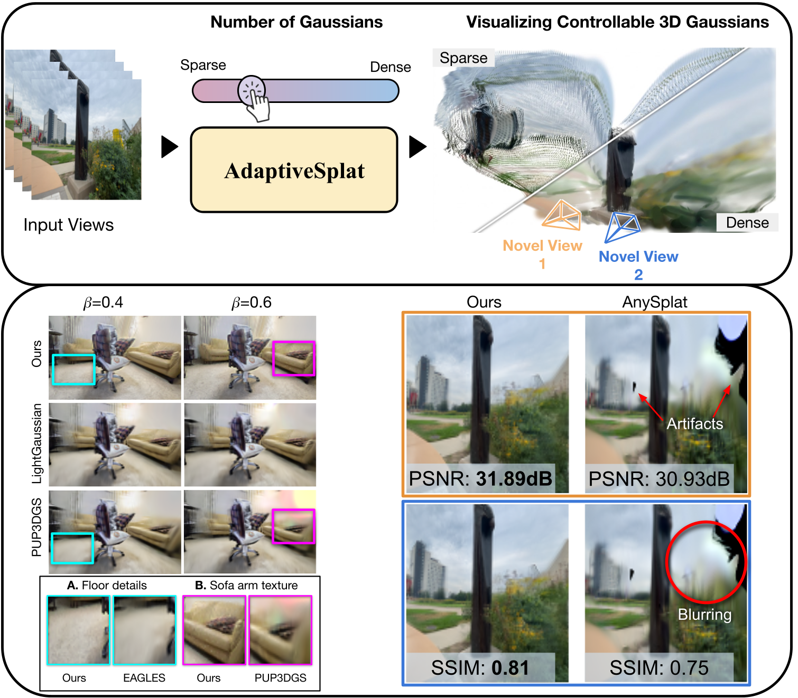

<div align="center">

# AdaptiveSplat:Texture Aware Controllable 3D Gaussian Allocation for Feed-Forward Reconstruction

**ECCV 2026**

[Project Page](https://badrinaths.github.io/projects/adaptive-splat/) · [Paper](https://arxiv.org/abs/2607.04256)  · [Model](https://huggingface.co/srihar2k3/adaptive-splat)

</div>

<p align="center">
  
</p>

## Overview

Current feed-forward 3D reconstruction methods predict pixel aligned Gaussian primitives, resulting in highly redundant representations. A natural solution is to prune the redundant Gaussians, but naive pruning introduces severe artifacts and often requires inference time fine-tuning, breaking the feed-forward paradigm. Based on previous works, high frequency regions require more Gaussian primitives, while low frequency regions can be represented with significantly fewer primitives. Motivated by this, we propose a novel approach to explicitly control the number of Gaussians by leveraging local texture information. Our approach achieves this through three key components: (1) texture estimation to capture spatial variation in scene detail, (2) texture-aware pruning that removes redundant Gaussians from low frequency regions, and (3) an adaptive Gaussian head that predicts the modified attributes of the retained primitives without breaking the feed-forward paradigm. Experiments on RE10K, ACID, DL3DV, Tanks and Temples, and DTU demonstrate the effectiveness of our approach, while ablation studies validate the contributions of its key components.

## Installation

Requires Linux, Python 3.10, and a CUDA-capable GPU (tested with CUDA 12.1).

```bash
# 1) Create the environment
conda create -y -n adaptive-splat python=3.10
conda activate adaptive-splat

# 2) Install PyTorch matching your CUDA toolkit
pip install torch==2.2.0 torchvision==0.17.0 torchaudio==2.2.0 \
    --index-url https://download.pytorch.org/whl/cu121

# 3) Install the remaining dependencies
pip install -r requirements.txt

# 4) Build the CroCo RoPE CUDA kernels
cd src/model/encoder/backbone/croco/curope && pip install -e . && cd -
```

Alternatively, use the conda spec: `conda env create -f environment.yml`.

## Dataset Preparation


Set the dataset location in the corresponding config (e.g.
`config/dataset/dl3dv.yaml`):

```yaml
roots: [datasets/dl3dv]   # path to your dataset
```

## Training


```bash
# Sample fully-working training command (single GPU, W&B disabled):
CUDA_VISIBLE_DEVICES=0 python -m src.main +experiment=dl3dv wandb.mode=disabled
```

To resume/initialize from a
checkpoint, add `checkpointing.load=/path/to/epoch_X-step_Y.ckpt`.

## Evaluation


```bash

# Sample test command (novel-view synthesis on DL3DV).
# Point checkpointing.load at a checkpoint produced by training above:
CUDA_VISIBLE_DEVICES=0 python -m src.main +experiment=dl3dv mode=test \
  wandb.mode=disabled \
  dataset.dl3dv.view_sampler.num_context_views=9 \
  test.global_prune_percent=80 \
  checkpointing.load=checkpoints/model.ckpt

```

## Checkpoints

The base anysplat model is downloaded automatically from Hugging Face
(`lhjiang/anysplat`). Our fine-tuned checkpoints is provided here:

| Model | Dataset | Link |
|-------|---------|------|
| Ours  | DL3DV   | https://huggingface.co/srihar2k3/adaptive-splat |


## Citation

If you find this work useful, please cite our paper (and AnySplat):

```bibtex
@misc{singhal2026adaptivesplattextureawarecontrollable3d,
      title={AdaptiveSplat:Texture Aware Controllable 3D Gaussian Allocation for Feed-Forward Reconstruction}, 
      author={Badrinath Singhal and Srihari K G and Sreehari Iyer and Ankit Dhiman and Venkatesh Babu Radhakrishnan},
      year={2026},
      eprint={2607.04256},
      archivePrefix={arXiv},
      primaryClass={cs.CV},
      url={https://arxiv.org/abs/2607.04256}, 
}


```

## Acknowledgements

This project is built on top of [AnySplat](https://github.com/InternRobotics/AnySplat),
and reuses components from [DUST3R / CroCo](https://github.com/naver/dust3r),
[VGGT](https://github.com/facebookresearch/vggt), and
[gsplat](https://github.com/nerfstudio-project/gsplat). We thank the authors for
releasing their code.

## License

Released under the MIT License.

